```mermaid
graph TB
    Admin["👤<br/>Admin"]
    WaliKelas["👤<br/>Wali Kelas"]

    subgraph System["🏫 SIAKAD SD Rawa Gempol"]
        Login(("Login"))
        Logout(("Logout"))
        Dashboard(("Lihat Dashboard"))

        ViewGuru(("Lihat Guru"))
        TambahGuru(("Tambah Guru"))
        EditGuru(("Edit Guru"))
        HapusGuru(("Hapus Guru"))

        ViewKelas(("Lihat Kelas"))
        TambahKelas(("Tambah Kelas"))
        EditKelas(("Edit Kelas"))
        HapusKelas(("Hapus Kelas"))

        ViewSiswa(("Lihat Siswa"))
        TambahSiswa(("Tambah Siswa"))
        EditSiswa(("Edit Siswa"))
        HapusSiswa(("Hapus Siswa"))

        ViewNilai(("Lihat Nilai"))
        InputNilai(("Input Nilai"))
        EditNilai(("Edit Nilai"))
        HapusNilai(("Hapus Nilai"))

        ViewKehadiran(("Lihat Kehadiran"))
        InputKehadiran(("Input Kehadiran"))
        EditKehadiran(("Edit Kehadiran"))
        HapusKehadiran(("Hapus Kehadiran"))

        ViewLaporan(("Lihat Laporan"))
        ExportLaporan(("Export Excel"))

        ViewSPK(("Lihat SPK"))
        TambahSPK(("Tambah SPK"))
        EditSPK(("Edit SPK"))
        HapusSPK(("Hapus SPK"))
    end

    Admin --> Login
    WaliKelas --> Login

    Admin --> Logout
    WaliKelas --> Logout

    Admin --> Dashboard
    WaliKelas --> Dashboard

    Admin --> ViewGuru
    ViewGuru --> TambahGuru
    ViewGuru --> EditGuru
    ViewGuru --> HapusGuru

    Admin --> ViewKelas
    ViewKelas --> TambahKelas
    ViewKelas --> EditKelas
    ViewKelas --> HapusKelas

    Admin --> ViewSiswa
    ViewSiswa --> TambahSiswa
    ViewSiswa --> EditSiswa
    ViewSiswa --> HapusSiswa

    Admin --> ViewNilai
    WaliKelas --> ViewNilai
    ViewNilai --> InputNilai
    ViewNilai --> EditNilai
    ViewNilai --> HapusNilai

    Admin --> ViewKehadiran
    WaliKelas --> ViewKehadiran
    ViewKehadiran --> InputKehadiran
    ViewKehadiran --> EditKehadiran
    ViewKehadiran --> HapusKehadiran

    Admin --> ViewLaporan
    WaliKelas --> ViewLaporan
    ViewLaporan --> ExportLaporan

    Admin --> ViewSPK
    ViewSPK --> TambahSPK
    ViewSPK --> EditSPK
    ViewSPK --> HapusSPK

    style Admin fill:#fff,stroke:#333,stroke-width:3px
    style WaliKelas fill:#fff,stroke:#333,stroke-width:3px
    style System fill:#f0f0f0,stroke:#333,stroke-width:2px
    style Login fill:#fff,stroke:#666,stroke-width:2px
    style Logout fill:#fff,stroke:#666,stroke-width:2px
    style Dashboard fill:#fff,stroke:#666,stroke-width:2px
    style ViewGuru fill:#e8f5e9,stroke:#4caf50,stroke-width:2px
    style TambahGuru fill:#e8f5e9,stroke:#4caf50,stroke-width:2px
    style EditGuru fill:#e8f5e9,stroke:#4caf50,stroke-width:2px
    style HapusGuru fill:#e8f5e9,stroke:#4caf50,stroke-width:2px
    style ViewKelas fill:#e8f5e9,stroke:#4caf50,stroke-width:2px
    style TambahKelas fill:#e8f5e9,stroke:#4caf50,stroke-width:2px
    style EditKelas fill:#e8f5e9,stroke:#4caf50,stroke-width:2px
    style HapusKelas fill:#e8f5e9,stroke:#4caf50,stroke-width:2px
    style ViewSiswa fill:#e8f5e9,stroke:#4caf50,stroke-width:2px
    style TambahSiswa fill:#e8f5e9,stroke:#4caf50,stroke-width:2px
    style EditSiswa fill:#e8f5e9,stroke:#4caf50,stroke-width:2px
    style HapusSiswa fill:#e8f5e9,stroke:#4caf50,stroke-width:2px
    style ViewNilai fill:#fff3e0,stroke:#ff9800,stroke-width:2px
    style InputNilai fill:#fff3e0,stroke:#ff9800,stroke-width:2px
    style EditNilai fill:#fff3e0,stroke:#ff9800,stroke-width:2px
    style HapusNilai fill:#fff3e0,stroke:#ff9800,stroke-width:2px
    style ViewKehadiran fill:#fff3e0,stroke:#ff9800,stroke-width:2px
    style InputKehadiran fill:#fff3e0,stroke:#ff9800,stroke-width:2px
    style EditKehadiran fill:#fff3e0,stroke:#ff9800,stroke-width:2px
    style HapusKehadiran fill:#fff3e0,stroke:#ff9800,stroke-width:2px
    style ViewLaporan fill:#fce4ec,stroke:#e91e63,stroke-width:2px
    style ExportLaporan fill:#fce4ec,stroke:#e91e63,stroke-width:2px
    style ViewSPK fill:#e0f2f1,stroke:#009688,stroke-width:2px
    style TambahSPK fill:#e0f2f1,stroke:#009688,stroke-width:2px
    style EditSPK fill:#e0f2f1,stroke:#009688,stroke-width:2px
    style HapusSPK fill:#e0f2f1,stroke:#009688,stroke-width:2px
```

# Use Case Diagram - SIAKAD SD Rawa Gempol

Diagram untuk aplikasi Sistem Informasi Akademik SD Rawa Gempol

## Instruksi Penggunaan di Draw.io:

1. Buka website https://draw.io
2. File > New > Blank Diagram
3. Extensions > More Shapes > cari "Mermaid"
4. Copy-paste kode di bawah ke dalam Mermaid shape

---

---

## Keterangan Diagram:

### **Aktor:**

- **Admin**: Akses penuh ke semua fitur
- **Wali Kelas**: Akses terbatas (Nilai, Kehadiran, Laporan, Dashboard)

### **Use Cases Utama:**

1. **Login/Logout** - Autentikasi sistem
2. **Dashboard** - Visualisasi data akademik
3. **Manajemen Guru** - CRUD data guru (Admin)
4. **Manajemen Kelas** - CRUD data kelas (Admin)
5. **Manajemen Siswa** - CRUD data siswa (Admin)
6. **Manajemen Nilai** - Input/kelola nilai (Admin & Wali Kelas)
7. **Manajemen Kehadiran** - Input/kelola absensi (Admin & Wali Kelas)
8. **Laporan** - View dan export laporan Excel (Admin & Wali Kelas)
9. **SPK Bantuan** - CRUD data bantuan (Admin)

### **Fitur Keamanan:**

- Role Based Access Control (RBAC)
- 2 Role: Admin & Wali Kelas
- LocalStorage untuk manajemen session
